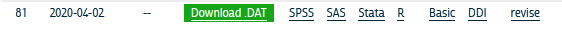
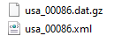

---
output:
  word_document: default
bibliography: book.bib
---

# Survey Data

This chapter is devoted to the descriptive analysis of complex survey data

## Demographic Survey data

The majority of demographic research relies on two or three main sources of information. First among these are population enumerations or censuses, followed by vital registration data on births and deaths and last but not least, data from surveys. Censuses and other population enumerations are typically undertaken by federal statistical agencies and demographers use this data once it's disseminated from these agencies. Similarly, vital registration data are usually collected by governmental agencies, who oversee the collection and data quality for the data. Survey data on the other hand can come from a wide variety of sources.

It's not uncommon for us to go and collect our own survey data specific to a research project we have, typically on a specialized population that we are interested in learning about, but surveys can also be quite general in their scope and collect information on a wide variety of subjects. Owing to the mix of small and large-scale survey data collection efforts, survey data are often available on many different topics, locales and time periods. Of course we as demographers are typically interested in population-level analysis or generalization from our work, so the survey data we try to use are collected in rigorous manners, with much attention and forethought paid to ensure the data we collect can actually be representative of the *target population* we are trying to describe.

In this chapter, I will introduce the nature of survey sampling as is often used in demographic data sources, and describe what to look for when first using a survey data source for you research. These topics are geared towards researchers and students who have not worked with survey data much in the past and will go over some very pragmatic things to keep in mind. Following this discussion, I will use a specific example from the US Census Bureau's American Community Survey and illustrate how to apply these principals to this specific source. The final goal of this chapter is to show how to use R to analyze survey data and produce useful summaries from our surveys, both tabular and graphically.

## Basics of survey sampling

To begin this section, I want to go over some of the simple terms from sampling that are very important to those of us who rely on survey data for our work. For many of the concepts from this chapter, I strongly recommend @Lohr2019 for the theoretical portions and @lumley2010 for discussion of how R is used for complex survey data.

The **target population** is the population that our survey has been designed to measure. For large national surveys, these are typically the population of the country of interest. For example, the Demographic and Health Survey (DHS) has it's primary target population as women of childbearing ages in women of reproductive age and their young children living in households. Our **observational units** are the level at which we are collecting data, for surveys this is typically a person or a household, and our survey documentation will tell us what its unit of observation is. **Sampling Units** refer to the units that can serve for us to collect data from, for example we may not have a list of every school age child, but we may have a list of schools, so we may use schools as our sampling units and sample children within them. The **sampling frame** is the set of sampling units containing distinct sets of population members, this is usually the most recent population census, ideally the entire population, or following our school example from above, the entire listing of schools.

These terms are ubiquitous in sampling, but other terminology also exists in many surveys and these terms relate to the nature of how the survey was actually carried out. Many times the surveys we end up using are not themselves **simple random samples**, but are instead some blend of stratified or cluster sample. For example, the DHS uses a stratified, cluster sample to collect its information. **Strata** refer to relatively homogeneous areas within the place we are trying to collect data. In the DHS, these are typically rural or urban areas of a country, as identified by the census. Within each strata, the DHS will choose **clusters** from which to sample from, this is a **two-stage sampling method**, where first the sampling frame is stratified, then clusters are selected. Clusters in the DHS are usually neighborhoods in urban areas and smaller towns or villages in rural areas.

Figure 1 shows a cartoon of how this process works, with multiple potential cluster that can be sampled (boxes), and within the cluster are our observational units, some of which are sampled, and some of which are unsampled.


### Simple versus complex survey designs

How the data we're using is sampled has a major implication for how we analyze it. The majority of statistical tools assume that data come from simple random samples, because most methods assume independence of observations, regardless of which distribution or test statistic you are using. Violations of this assumption are a big problem when we go to analyze our data, because the non-independence of survey data are automatically in violation of a key assumption of any test. The stratified and clustered nature of many survey samples may also present problems for methods such as linear regression analysis which assume errors in the model are **homoskedastic**, or constant. When data are collected in a stratified or clustered method, the data may have less variation than a simple random sample, because individuals who live closely to one another often share other characteristics in common as well. Our statistical models don't do well with this type of reduction in variation and we often have to resort to manipulations of our model parameters or standard errors of our statistics in order to make them coincide with how the data were collected.

Not to fear! Data collected using public funds are typically required to be made available to the public with information on how to use them. Most surveys come with some kind of code book or user manual which describes how the data were collected and how you should go about using them. In these cases, it pays to read the manual because it will tell you the names of the stratification and clustering variables in the survey data. This will allow you to use the design of the survey in your analysis so that your statistical routines are corrected for the non-randomness and homogeneity in the survey data.

**He's not heavy, he's my brother**

Another important aspect of survey data are the use of weighting variables. Whenever we design a survey, we have our target population, or universe of respondents in mind. In the DHS, again, this is traditionally[^surveydata-1] women of childbearing age and their children [@international_demographic_2012]. When we collect a sample from this population, or sample may be, and typically is, imperfect. It is imperfect for many reasons, owing to the difficulty of sampling some members of the population, or their unwillingness to participate in our study. Part of designing an effective survey is knowing your universe or population, and its characteristics. This will let you know the probability of a particular person being in the sample. Of course, the more complicated the survey, the more complicated it is to know what this probability is. For example, if we were to sample people in the United States, using a stratified design based on rural and urban residence, we would need to know how many people lived in rural and urban areas within the country, as this would effect the probability of sampling a person in each type of area. This **inclusion probability** tells us how likely a given person is of being sampled. The inverse of the inclusion probability is called the **sampling weight**:

[^surveydata-1]: The modern DHS collects information on couples, men and children, so the universe has been expanded away from just women of childbearing age and their children.

$w_i = \frac{1} {\pi_i}$

where $\pi_i$ is the inclusion probability.

Sampling weights are what we use to make our analyses of a survey representative of the larger population. They serve many purposes including unequal inclusion probabilities, differences in sample characteristics compared to the larger population, and differences in response rates across sample subgroups. All of these situations make the sample deviate from the population by affecting who the actual respondents included in the survey are. Differences in our sample when compared to the larger population can affect most all of our statistical analysis since again, most methods assume random sampling. The weights that are included in public data are the result of a rigorous process conducted by those who designed and implemented the survey itself, and most surveys in their user manuals or code books describe the process of how the weights are created. For example, the US Center for Disease Control and Prevention's Behavioral Risk Factor Surveillance System (BRFSS) provides a very thorough description of how their final person weights are calculated [@cdc2020]. These weights include three primary factors, the *stratum weight*, which is a combination of the number of records in a sample strata and the density of phone lines in a given strata, combined with the number of phones in a sampled household and the number of adults in the household to produce the final design weight. These weights are then **raked** to eight different marginal totals, based on age, race/ethnicity, education, marital status, home ownership, gender by race/ethnicity, age by race/ethnicity and phone ownership[@cdc2020]. After this process, weights are interpretable as the number of people a given respondent in the survey represents in the population. So, if a respondent's weight in the survey data is 100, they actually represent 100 people in the target population.

Other types of weights also exist, and are commonly seen in federal data sources. A common kind of weight that includes information on both the probability of inclusion **AND** the stratified design of the survey are **replicate weights**. Replicate weights are multiple weights for each respondent, and there are as many weights as there are different levels of the stratification variable. Later in this chapter, we will discuss how replicate weights are used, as compared to single design weights in an example.

## Characteristics of YOUR survey

Survey data that come from reputable sources, such as most federal agencies or repositories such as the Inter-university Consortium for Political and Social Research (ICPSR) at the University of Michigan in the United States, are accompanied by descriptions of the data source including when and where it was collected, what it's target population is, and information on the design of the survey. This will include information on sample design, such as stratum or cluster variables, and design or replicate weights to be used when you conduct your analysis. I cannot stress enough that learning how your particular survey data source is designed, and how the designers recommend you use provided survey variables for your analysis, is imperative to ensure your analysis is correctly specified.

## Example from the American Community Survey

Let's look at an example of these ideas in a real data source. Throughout the book I will use several complex survey design data sources to illustrate various topics, in this chapter I will use data from the US Census Bureau's American Community Survey (ACS) public use microdata sample (PUMS). We can actually use the `tidycensus` package [@walker21] to download ACS PUMS directly from the Census Bureau.

This example shows how to extract the 2018 single-year PUMS for the state of Texas, and only keep variables related to person-records. The ACS has information on both people and households, but for now we'll only look at the person records. Help on these functions can be found by typing `?pums_variables` and `?get_pums` in `R`

```{r ch2_1, eval=TRUE,results='hide', message=FALSE, warning=FALSE, include=TRUE}
library(tidycensus)
library(tidyverse)

pums_vars_18<- pums_variables %>%
  filter(year== 2018, survey == "acs1") %>%
  distinct(var_code, var_label, data_type, level) %>%
  filter(level == "person")

TX_pums <- get_pums(
  variables = c("PUMA", "SEX", "AGEP", "CIT", "JWTR","JWRIP", "HISP"),
  state = "TX",
  survey = "acs1",
  year = 2018)

```

```{r, results='asis'}
knitr::kable(
  head(TX_pums),
  format = 'html'
  )

```

These data are also easily available from the Integrated Public Use Microdata Series (IPUMS) project housed at the University of Minnesota [@Ruggles2021]. The IPUMS version of the data adds additional information to the data and homogenizes the data across multiple years to make using it easier. The following example will use the `ipumsr` package to read in an extract from IPUMS-USA.

\<start\>

After you create an IPUMS extract, right click on the DDI link and save that file to your computer. Then repeat this for the .DAT file. If you need help creating an IPUMS extract, their staff have created a tutorial for doing so (<https://usa.ipums.org/usa/tutorials.shtml>).

This will save the xml file that contains all the information on the data (what is contained in the data file) to your computer. When using IPUMS, it will have a name like `usa_xxxxx.xml` where the x's represent the extract number.

You will also need to download the data file, by right clicking the **Download.DAT** link in the above image. This will save a .gz file to your computer, again with a name like: `usa_xxxxx.dat.gz`. Make sure this file and the xml file from above are in the same folder.



The fundamentals of using `ipumsr` is to specify the name of your `.xml` file from your extract, and as long as your `.tar.gz` file from your extract is in the same location, R will read the data. The files on my computer:



```{r ch2_2,eval=TRUE,results='hide', message=FALSE, warning=FALSE, include=TRUE}

library(ipumsr)

ddi <- read_ipums_ddi(ddi_file = "data/usa_00086.xml")
ipums <- read_ipums_micro(ddi = ddi,
                          n_max = 1000)

```

Will read in the data, in this case, it is a subset of the 2008 to 2012 single year ACS. This extract is not all of the variables from the ACS, as that would be a very large file and for my purposes here, I don't need that. My goal for the rest of the chapter is to illustrate how to use the IPUMS as an example of a complex survey design data set and the steps necessary to do so.

## Basics of analyzing survey data

A fundamental part of analyzing complex survey data are knowing the variables within the data that contain the survey design information. The US Census Bureau has documented the desing of the survey in a publication [@uscensusbureau2014] The IPUMS version of the ACS has two variables `STRATA` and `CLUSTER` that describe the two stage process by which the data are collected. Here are a the first few lines of these from the data:

```{r ch2_3,eval=TRUE,results='hide', message=FALSE, warning=FALSE, include=TRUE}
options(scipen = 999)
library(knitr)
  
kable(head(ipums[, c("SERIAL", "STRATA", "CLUSTER")],
           n=10),
      digits = 14 )

```

For the ACS, the strata is

## Replicates and jack knifes and expansions, oh my!

Most data sources will either have a single weight and or replicate weights

## Descriptive analysis of survey data

## Tables and graphical summaries

### References

```{r include = FALSE}
# automatically create a bib database for R packages
knitr::write_bib(c(
  .packages(), 'bookdown', 'knitr', 'rmarkdown'
), 'packages.bib')
```
