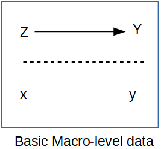

---
output:
  html_document: default
  pdf_document: default
bibliography: book.bib
---

\newpage

```{r, include = FALSE}
library(tidyverse)
library(tmap)
library(ggplot2)
library(tigris)
library(sf)
```

# Macro demographic data analysis

Prior to the advent in the 1960's of large scale social surveys like the General Social Survey (GSS), most demographic research was done not on individuals but on aggregates, because that's how data were available. If you look at texts such as @keyfitz_introduction_1968, all of the examples are for national level calculations, and many nations did not have sufficient data availability to produce quality statistical summaries of their populations, resulting in publications such as the United Nations Population Division's famous Manual X [-@united_nations_population_division_manual_1983], which gave pragmatic formulas to measure a wide variety of demographic indicators at the national level using basic inputs, usually available from census summaries.

Paul Voss [-@voss_demography_2007] describes most demography (and certainly most demographic studies prior to the 1970's and 1980's) as **Macro** demography. Voss also mentions that prior to the availability of individual level microdata, all demography was macro-demography, and most demographic studies were spatial in nature, because demographic data were only available in spatial units corresponding to administrative areas. Typical types of geographic areas would be counties, census tracts, ZIP codes, state or nations.

\<\<\<\<\<\<\< Updated upstream In the macro-demographic perspective on demography, observations are typically places, areas, or some other aggregate level of individuals. We do not observe the individual people themselves often times. An example of this is if you were to have access to an aggregate count of deaths in a region, even if the deaths were classified by age and sex, you still would be dealing with data that ignores, or has no index to the more nuanced characteristics of the individual decedents themselves. That being said, data such as these are invaluable, and most demographic summaries of individual-level data would aggregate based on the characteristics of the individuals any way. The macro scale principal is illustrated below, where all of the variables we observe are a scale above the individual person.



Such **macro-level propositions** are hypothesized relationships among variables ($\rightarrow$) measured at a macro scale ($Z$ and $Y$), which ignores individual level data, mostly because we don't observe individuals ($x$ and $y$) in many of these kinds of analysis.

If all we looked at were the individuals within the population, we would be overwhelmed by the variation that we would see, and we wouldn't be doing statistics anymore, we would be trying to process a million anecdotes, and the plural of anecdote is not data. By aggregating across basic demographic groups, such as age and sex, demographers begin to tease apart the differences that we are interested in. If we go a little further and, data willing, aggregate not only across these fundamental demographic groups, but also across some kind of place-based areal unit, then we adding an extremely important part of human existence: the **where** part of where we live.

This presents an attractive view of populations and typically data on places are more widely available, but there are caveats we must be aware of. If we are using purely aggregate data in our analysis, meaning that we do not have access to the individual level microdata, then our ability to observe variation within a place is extremely limited, if not impossible.

The goal of this chapter is to illustrate how places are a special unit of analysis, and the types of data we often see at the place level are very different from individual level surveys. Additionally, the analysis of place-based data is similar to survey data in that places are do not necessarily represent random observations, and so analyzing data on places often requires special modifications to statistical models. In this chapter, I show how the the linear regression model can be expanded in several ways and illustrate the generalized linear model as a very useful and extendable tool to analyze data on places and especially when we are analyzing rates as demographers often do.

## Getting data on places

In the macro-demographic perspective on demography, observations are typically places, areas, or some other aggregate level of individuals. We do not observe the individual people themselves often times. An example of this is if you were to have access to an aggregate count of deaths in a region, even if the deaths were classified by age and sex, you still would be dealing with data that ignores, or has no index to the more nuanced characteristics of the individual decedents themselves. That being said, data such as these are invaluable, and most demographic summaries of individual-level data would aggregate based on the characteristics of the individuals any way. The macro scale principal is illustrated below, where all of the variables we observe are a scale above the individual person.


Such **macro-level propositions** are hypothesized relationships among variables ($\rightarrow$) measured at a macro scale ($Z$ and $Y$), which ignores individual level data, mostly because we don't observe individuals ($x$ and $y$) in many of these kinds of analysis.

If all we looked at were the individuals within the population, we would be overwhelmed by the variation that we would see, and we wouldn't be doing statistics anymore, we would be trying to process a million anecdotes, and the plural of anecdote is not data. By aggregating across basic demographic groups, such as age and sex, demographers begin to tease apart the differences that we are interested in. If we go a little further and, data willing, aggregate not only across these fundamental demographic groups, but also across some kind of place-based areal unit, then we adding an extremely important part of human existence: the **where** part of where we live.

This presents an attractive view of populations and typically data on places are more widely available, but there are caveats we must be aware of. If we are using purely aggregate data in our analysis, meaning that we do not have access to the individual level microdata, then our ability to observe variation within a place is extremely limited, if not impossible.

The goal of this chapter is to illustrate how places are a special unit of analysis, and the types of data we often see at the place level are very different from individual level surveys. Additionally, the analysis of place-based data is similar to survey data in that places are do not necessarily represent random observations, and so analyzing data on places often requires special modifications to statistical models. In this chapter, I show how the the linear regression model can be expanded in several ways and illustrate the generalized linear model as a very useful and extendable tool to analyze data on places and especially when we are analyzing rates as demographers often do.

## Getting data on places

Typically when thinking about data on places, we are really referring to some sort of administrative geography, such as nations, states, region, and census tracts. While these are often readily available (and I'll show some R package that can easily get data from the web), we often have to use these as proxy measures of more interesting social spaces like neighborhoods and other types of activity spaces. These social spaces are harder to get data on, typically because they are more fluid in their definitions, and there is generally not a systematic effort to produce data on socially defined spaces on national scales. This is a big part of doing macro demography, defining the scale and the unit of analysis, both because we need to define the scope of our work, but also we are very much constrained by the availability of data for our projects. For instance, I may want to look at national scale inequality in mortality risk in neighborhoods in the United States, but you immediately face a couple of hurdles. No national data source identifies sub-city residential location for death certificates, also, what are neighborhoods? Again, they're probably some socially defined space that may not be available from a national scale source. To get around this, we may have to settle for a state-level analysis, because state vital registration systems will often allow researchers to use more fine-scale geographic data on death certificates (such as latitude/longitude of the decedent's residence), and once we have very fine scale geographic data on the vital events, we could potentially find data on some more socially defined spaces, perhaps from cities who often maintain geographic data on neighborhoods specific to that city. OK, so that's fine, but then you still run into the "what's my denominator" problem, where you have no baseline population data on the age and sex breakdown of the population, or even the population size of these places, because federal agencies don't produce estimates for such small scale areas. *This is frustrating*. Often when advising students on their dissertation projects, I have to have this moment of truth where I lay out the problems of the mixing of geographic scales for their projects, and the hard reality of the lack of data on so many things they would like to study. Often what happens is that we have to proxy our ideal places with places for which we can find data. You see this a lot in the population health literature, where people want to analyze *neighborhoods* but all they have are census tracts. Tracts aren't social spaces! They're arbitrary areas of 3 to 5 thousand people, that change every 10 years, that the Census uses to count people. Likewise, counties are very rich areas to find data for, but they are not really activity spaces or neighborhoods, but they may be areas that have some policy making authority (such as county health departments) that *could* be relevant for something. States are also nice geographies, they're very large, so you loose the ability to contextualize behavior on a fine spatial scale, but states make a lot of decisions that affect the lives of their residents, often more than national decisions. States have become very popular units of analysis in the health literature again, primarily as a result of differential adoption of portions of the Patient Protection and Affordable Care Act of 2010 [@soni2017a; @courtemanche2019]. This being said, many times when we do an analysis on places, that analysis has lots of limitations, which we must acknowledge, and analyses such as these are often called *ecological* analyses because we are examining associations at the macro scale, and we do not observe individual level outcomes.

## US contexts

The US Census bureau produces a wide variety of geographic data products that are the most widely used forms of geographic data for demographic studies in the United States. The TIGER Line Files data consist of geographic data with census bureau GEOIDs attached so they can be linked to any number of federal statistical products. They do not contain demographic data themselves, but are easily linked. The `tigris` package in R provides a direct way to download any TIGER line file data type directly in a R session as either a *simple feature* class or as a \*Spatial\_\_DataFrame\* [@tigris].

Using the tigris package is very easy and its functions fit directly into the tidyverse as well. Below, I download two layers of information, first the state polygon for New York state, and the census tracts within the state and overlay the two datasets on each other. The package has a function for each type of geography that you would want, for example `states()` downloads state level geographies and `tracts()` does the same for census tracts. The functions have some common arguments, including `cb = TRUE/FALSE` so you can choose cartographic boundary files or not. Cartographic boundary files are lower resolution, smaller files that are often used for thematic mapping. Also `year =` will allow you to get different annual vintages of the data. The `tracts()` function also allows you to obtain geographies for specific counties within a state.

```{r, results='hide'}
library(tigris)

nyst <- states(cb = TRUE,
               year = 2010) %>%
  filter(NAME == "New York")

nyst_ct <- tracts(state = "NY",
                  cb = TRUE,
                  year = 2010)

ggplot(data=nyst)+
  geom_sf(color = "red", 
          lwd = 2)+
   geom_sf(data = nyst_ct,
           fill = NA,
           color = "blue") + 
  ggtitle(label = "New York State Census Tracts")

```

### Tidycensus

Another package the provides access to the US Census Bureau Decennial census summary file , the American Community Survey, Census population estimates, migration flow data and Census Public Use Microdata Sample (PUMS) data is `tidycensus` [@walker21]. The `tidycensus` package primarily works to allow users to use the Census Bureau's Application Programming Interface (API) to download Census summary file data for places within an R session. This removes the need to download separate files to your computer, and allows users to produce visualizations of Census data easily. The package is actively maintained and has several online tutorials on how to use it [^macrodem-1]. Depending on which data source you are interested in, there are functions that allow extracts from them. The ACS data is accessed through the `get_acs()` function, likewise the decennial census data is accessed using the `get_decennial()` function. The package also allows users to test for differences in ACS estimates either across time or between areas using the `significance()` function.

The package requires users to obtain a developer API key from the Census Bureau's developer page[^macrodem-2] and install it on your local computer. The package has a function that helps you install the key to your `.Renviron` file. It is used like this:

```{r, eval = FALSE}
census_api_key(key = "yourkeyhere", install = TRUE)
```

which only needs to be done once.

A basic use of the `tidycensus` package is to get data and produce maps of the indicators. This is done easily because `tidycensus` fits directly into general `dplyr` and `ggplot2` workflows. Below is an example of accessing 2019 ACS data on poverty rate estimates for New York census tracts from New York county, New York. The sytax takes several arguments indicating what level of census geography you want, the year of the estimates, the details of states and counties you may want, and which ACS tables you want. Here I use the Data Profile table for the percentage estimate of families with incomes below the poverty line. The `output = "wide"` option is useful if you get multiple estimates, as it arrages them into columns, one for each estimate. 


```{r, results = 'hide'}
library(tidycensus)

nyny <- get_acs(geography = "tract",
                year = 2018,
                state = "NY",
                county = "061",
                variables = "DP03_0119PE", 
                output = "wide",
                geometry = TRUE)

```

The tabular output shows the Estimate column ending in *E* and the ACS margin of error column ending in *M*. 

```{r}
knitr::kable(x = head(nyny),
             format = "html")

```


The `geometry = TRUE` option also download the TIGER line file for the requested geography and merges it to the ACS estimates. This allows you to immediately map the estimates for the requested geographies. 

```{r, include = FALSE}
options(tigris_use_cache = TRUE)
```

```{r}
# Create map of estimates
nyny %>% 
  rename (Poverty_Rt = DP03_0119PE)%>%
  ggplot(aes(fill = Poverty_Rt))+
  geom_sf()+
  scale_fill_viridis_c()+
  ggtitle ( label = "Poverty Rate in New York Census Tracts", 
            subtitle = "2018 ACS Estimates")

```

The `tidycensus` package had a great array of functions and the author Kyle Walker has published a book on using it *FILL IN CITATION* which covers its many uses.

One common task that we should do when visualizing ACS estimates is to examine the coefficient of variation in the estimates. This gives us an idea of how stable the estimates are. This can be particularly problematic as we use smaller and smaller geographies in our analysis. Below, I calculate the coefficient of variation for the estimates and map it. To get the standard error of the ACS estimate, I divide the margin of error by 1.645, following Census Bureau recommendations [@us_census_bureau_worked_nodate]. 

```{r}
nyny %>% 
  mutate ( cv =ifelse(test = DP03_0119PE==0,
                      yes = 0,
                      no = (DP03_0119PM/1.645) / DP03_0119PE))%>%
  ggplot(aes(fill = cv))+
  geom_sf()+
  scale_fill_viridis_c()+
  ggtitle ( label = "Poverty Rate Coefficient of Variation\n in New York Census Tracts", 
            subtitle = "2018 ACS Estimates")

```

which shows areas with the highest coefficient of variations mostly adjacent to Central Park and on the lower west side of Manhattan. These are also the areas with the lowest poverty rates in the city, so the estimates have low precision because so few respondents report incomes below the poverty line. 

[^macrodem-1]: $\bar{y}= \text{mean of y}$, $\bar{x}= \text{mean of x}$

[^macrodem-2]: http://api.census.gov/data/key_signup.html

### IPUMS NHGIS

The IPUMS NHGIS project [^macrodem-3] is also a great source for demographic data on US places, and allows you to select many demographic tables for census data products going back to the 1790 census [@nhgis]. When you perform an extract from the site, you can get both data tables and ESRI shapefiles for your requested geographies. The IPUMS staff have created several tutorials which go through how to construct a query from their site [^macrodem-4]. Below, I use the `sf` library to read in the geographic data from IPUMS and the tabular data and join them.

```{r}
library(sf)
ipums_co <- read_sf("~/OneDrive - University of Texas at San Antonio/projects/book_data/US_county10_2000.shp")


im_dat <- readr::read_csv("~/OneDrive - University of Texas at San Antonio/projects/book_data/nhgis0025_ds231_2005_county.csv")

m_dat <- left_join(x = ipums_co,
                   y = im_dat,
                   by = c("GISJOIN" = "GISJOIN"))

m_dat %>%
  filter(STATE == "New York" )%>%
  ggplot()+
  geom_sf(aes (fill = AGWJ001))+
  scale_fill_viridis_c()+
  ggtitle(label = "Infant Mortality Rate per 10,000 Live Births",
          subtitle = "New York, 2005")
```

[^macrodem-3]: Link to AHRF codebook - ["https://data.hrsa.gov/DataDownload/AHRF/AHRF_USER_TECH_2019-2020.zip"](https://data.hrsa.gov/DataDownload/AHRF/AHRF_USER_TECH_2019-2020.zip)

[^macrodem-4]: More on this below

### International data

Sources of international data exist in numerous sites on the internet. Personally, I frequently will use the DHS Spatial Data repository [^macrodem-5] to access data from DHS sampled countries. This repository allows you to obtain both spatial administrative boundary data, as well as key indicators of maternal and child health at sub-national levels. The `rdhs` package allows you to perform queries from the spatial data repository and from the DHS microdata as well [@rdhs].

[^macrodem-5]: More on this below
